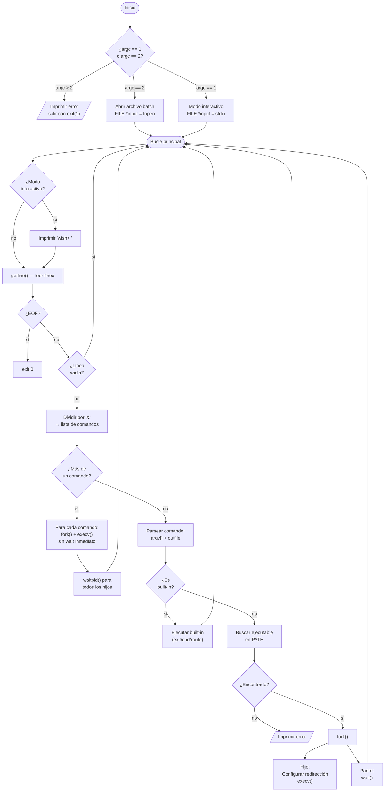
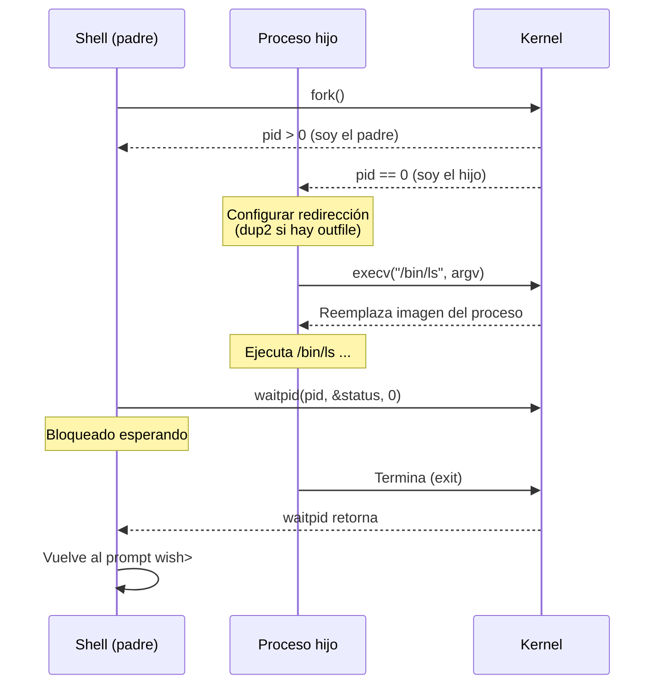
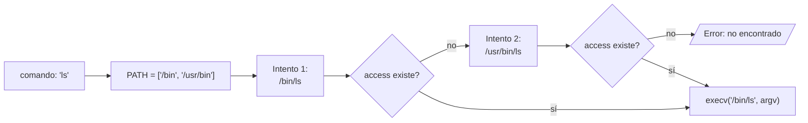
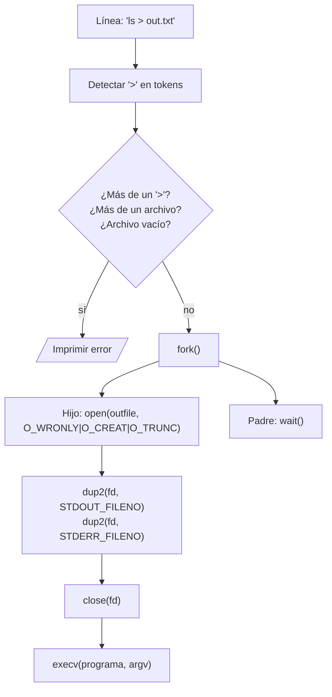

# wish — Wisconsin Shell
### Laboratorio 2 · Sistemas Operativos · Universidad de Antioquia · 2026-1

---

## Tabla de Contenidos

1. [Equipo](#1-equipo)
2. [Descripción del Proyecto](#2-descripción-del-proyecto)
3. [¿Qué es un Shell CLI?](#3-qué-es-un-shell-cli)
4. [Arquitectura del Shell](#4-arquitectura-del-shell)
5. [Documentación de Características](#5-documentación-de-características)
   - 5.1 [Bucle Principal](#51-bucle-principal)
   - 5.2 [Resolución de PATH](#52-resolución-de-path)
   - 5.3 [Comandos Built-in](#53-comandos-built-in)
   - 5.4 [Redirección (`>`)](#54-redirección-)
   - 5.5 [Comandos Paralelos (`&`)](#55-comandos-paralelos-)
   - 5.6 [Modo Batch vs Modo Interactivo](#56-modo-batch-vs-modo-interactivo)
6. [Referencia de Syscalls](#6-referencia-de-syscalls)
7. [Documentación de Funciones](#7-documentación-de-funciones)
8. [Manejo de Errores](#8-manejo-de-errores)
9. [Plan de Pruebas](#9-plan-de-pruebas)
10. [Problemas y Soluciones](#10-problemas-y-soluciones)
11. [Manifiesto de Transparencia IA](#11-manifiesto-de-transparencia-ia)

---

## 1. Equipo

| Campo              | Integrante 1          | Integrante 2          |
|--------------------|-----------------------|-----------------------|
| **Nombre completo**| _[Tu nombre aquí]_    | _[Nombre compañero]_  |
| **Correo UdeA**    | _[correo@udea.edu.co]_| _[correo@udea.edu.co]_|
| **Documento**      | _[CC XXXXXXXXXX]_     | _[CC XXXXXXXXXX]_     |
| **GitHub**         | _[@usuario]_          | _[@usuario]_          |

---

## 2. Descripción del Proyecto

`wish` (*Wisconsin Shell*) es un intérprete de comandos Unix implementado en C como parte del Laboratorio 2 del curso de Sistemas Operativos. El objetivo es comprender en profundidad cómo funciona un shell real: cómo lee comandos del usuario, cómo los divide en tokens, cómo busca ejecutables en el sistema de archivos, cómo crea procesos hijos mediante `fork()`, y cómo redirige flujos de entrada/salida.

### Especificaciones clave

| Característica        | Detalle                                             |
|-----------------------|-----------------------------------------------------|
| **Prompt**            | `wish> ` (espacio después del `>`)                  |
| **PATH inicial**      | Solo `/bin`                                         |
| **Built-ins**         | `exit`, `chd`, `route`                              |
| **Redirección**       | `>` redirige stdout **y** stderr a un archivo       |
| **Paralelismo**       | `&` separa comandos que se ejecutan simultáneamente |
| **Modo batch**        | `./wish archivo.txt` — sin prompt, lee del archivo  |
| **EOF**               | Llama `exit(0)` automáticamente                     |
| **Error universal**   | Siempre imprime `"An error has occurred\n"` a stderr|

---

## 3. ¿Qué es un Shell CLI?

Un **shell** (intérprete de comandos) es el programa que actúa de intermediario entre el usuario y el kernel del sistema operativo. Cuando escribes `ls -l` en una terminal, no le estás hablando directamente al kernel — le estás hablando al shell.

### Flujo conceptual de alto nivel

```
  ┌──────────┐    escribe     ┌──────────┐   parsea    ┌──────────────┐
  │ Usuario  │ ────────────►  │  Shell   │ ──────────► │  Argumentos  │
  └──────────┘                └──────────┘             └──────┬───────┘
                                                              │
                              ┌───────────────────────────────┘
                              │
                    ¿es built-in?
                    ┌────yes──┴───no────┐
                    ▼                  ▼
             ejecuta directo       fork() → hijo
             (exit/chd/route)      execv()  │
                                            ▼
                                    programa externo
                                    (/bin/ls, /bin/cat…)
                                            │
                              padre: wait() hasta que hijo termina
                                            │
                                            ▼
                                    vuelve al prompt
```

### ¿Por qué `fork()` + `execv()`?

El modelo Unix de creación de procesos usa dos pasos:

1. **`fork()`** — duplica el proceso actual. El proceso hijo es una copia exacta del padre.
   - Retorna **`0`** dentro del proceso hijo.
   - Retorna el **PID del hijo** (número > 0) dentro del proceso padre.
   - Retorna **`-1`** si hubo error (no se pudo crear el proceso).
2. **`execv()`** — en el hijo, *reemplaza* la imagen del proceso con el programa que queremos ejecutar.
   - **Si tiene éxito, NUNCA retorna.** El proceso hijo queda ejecutando el programa nuevo.
   - **Si retorna, es porque falló** (programa no encontrado, sin permisos, etc.). Después de un `execv()` fallido hay que llamar `exit(1)` en el hijo.

> **¿Por qué no usar `system()`?** La función `system()` existe pero está **prohibida** en este proyecto. `system()` invoca `/bin/sh` internamente (un shell dentro del shell) y no te da control sobre redirecciones ni descriptores de archivo.

Esto permite al padre (el shell) seguir vivo después de que el hijo termine, y también permite configurar el entorno del hijo (redirecciones, señales, etc.) *entre* el `fork()` y el `execv()`.

```
pid_t pid = fork();
if (pid == 0) {
    // SOY EL HIJO
    // Aquí configuro redirección (dup2), luego:
    execv("/bin/ls", argv);
    // Si llego aquí, execv falló:
    exit(1);
} else {
    // SOY EL PADRE (pid > 0)
    wait(NULL);  // espero a que el hijo termine
}
```

---

## 4. Arquitectura del Shell

### Diagrama principal del bucle del shell



### Ciclo de vida de un proceso (fork/exec/wait)



---

## 5. Documentación de Características

### 5.1 Bucle Principal

El shell ejecuta un bucle infinito: lee una línea, la procesa, ejecuta, y vuelve a empezar. Solo se detiene cuando recibe EOF o se llama `exit`.

```
  ┌─────────────────────────────────────────────────────────┐
  │                    BUCLE PRINCIPAL                       │
  │                                                         │
  │  ┌──────────┐    ┌──────────┐    ┌──────────────────┐  │
  │  │  READ    │───►│  PARSE   │───►│    EXECUTE       │  │
  │  │ getline()│    │ strsep() │    │ builtin/fork+exec│  │
  │  └────▲─────┘    └──────────┘    └────────┬─────────┘  │
  │       │                                   │             │
  │       └───────────────────────────────────┘             │
  │                    (repite)                             │
  └─────────────────────────────────────────────────────────┘
```

**Casos de borde a manejar:**
- Línea vacía o solo espacios/tabs → ignorar, volver al prompt
- Línea con solo `\n` → ignorar
- `\n` al final de cada línea leída por `getline()` → eliminar con `line[strlen(line)-1] = '\0'`
- EOF en modo interactivo (Ctrl+D) → llamar `exit(0)`
- EOF en modo batch → también llamar `exit(0)` (fin del archivo de comandos)
- En modo batch el prompt **no se imprime**, pero todo lo demás funciona igual

---

### 5.2 Resolución de PATH

Cuando el usuario escribe `ls`, el shell no sabe dónde está ese programa. Debe buscar en cada directorio del PATH hasta encontrarlo.



**Implementación:**

```
Para cada directorio dir en path[]:
    construir candidato = dir + "/" + comando
    si access(candidato, X_OK) == 0:
        retornar candidato   ← ¡encontrado!
retornar NULL                ← no encontrado → error
```

**Syscalls usadas:** `access(path, X_OK)` para verificar que el archivo existe y es ejecutable.

**Casos de borde:**
- Comando vacío (solo espacios)
- Comando con `/` absoluto → usar directamente sin buscar en PATH
- PATH vacío (después de `route` sin args) → ningún externo puede ejecutarse
- Ejecutable existe pero no tiene permisos → `access` retorna -1

---

### 5.3 Comandos Built-in

Los built-ins se ejecutan **directamente en el proceso del shell**, sin `fork()`. Esto es necesario porque, por ejemplo, `chd` debe cambiar el directorio de trabajo del shell mismo — si se ejecutara en un hijo, el cambio no afectaría al padre.

| Built-in | Sintaxis          | Descripción                              | Error si...                    |
|----------|-------------------|------------------------------------------|--------------------------------|
| `exit`   | `exit`            | Termina el shell con `exit(0)`           | Se pasan argumentos            |
| `chd`    | `chd <directorio>`| Cambia el directorio con `chdir()`       | 0 o >1 argumentos; dir inválido|
| `route`  | `route [dir...]`  | Sobreescribe el PATH con los dirs dados  | Nunca falla (0 dirs = PATH vacío)|

**Tabla de comportamiento:**

```
  exit            → exit(0)              (sin args)
  exit /tmp       → error                (con args)
  chd /tmp        → chdir("/tmp")        (OK)
  chd             → error                (sin args)
  chd /a /b       → error                (>1 arg)
  route /bin /usr → PATH = [/bin, /usr]  (OK)
  route           → PATH = []            (OK, path vacío)
```

---

### 5.4 Redirección (`>`)

El operador `>` redirige tanto **stdout** (fd 1) como **stderr** (fd 2) al archivo especificado. Esto es diferente al shell estándar de Unix, donde `>` solo redirige stdout. En `wish`, **ambos** streams van al archivo — es el comportamiento requerido por la especificación.



**Diagrama de descriptores de archivo:**

```
ANTES del dup2():                  DESPUÉS del dup2():

fd 0 → stdin                       fd 0 → stdin
fd 1 → terminal (stdout)           fd 1 → out.txt  ← dup2(fd_archivo, 1)
fd 2 → terminal (stderr)           fd 2 → out.txt  ← dup2(fd_archivo, 2)
fd 3 → out.txt (recién abierto)    fd 3 → out.txt  ← cerrar con close(3)
```

**Casos de borde:**
- `ls > ` (sin nombre de archivo) → error
- `ls > a > b` (dos redirectores) → error
- `ls > a b` (dos tokens después de `>`) → error
- El archivo no se puede crear (permisos) → error en `open()`
- Built-ins con redirección: según la especificación, la redirección aplica a comandos externos

---

### 5.5 Comandos Paralelos (`&`)

El operador `&` separa comandos que deben ejecutarse **simultáneamente**. El shell hace `fork()` para cada comando sin hacer `wait()` inmediato, y luego espera a todos al final.

```mermaid
gantt
    title Ejecución paralela: "ls & sleep 2 & echo hola"
    dateFormat X
    axisFormat %s

    section Shell (padre)
    fork hijo 1 (ls)      :milestone, 0, 0
    fork hijo 2 (sleep 2) :milestone, 0, 0
    fork hijo 3 (echo)    :milestone, 0, 0
    waitpid todos         :active, 0, 2

    section Hijo 1 (ls)
    execv ls              :active, 0, 1

    section Hijo 2 (sleep 2)
    execv sleep 2         :active, 0, 2

    section Hijo 3 (echo)
    execv echo            :active, 0, 1
```



**Pseudocódigo de ejecución paralela:**

```
pids[] = arreglo vacío

para cada comando en comandos[]:
    pid = fork()
    si pid == 0 (soy hijo):
        configurar redirección si aplica
        execv(ejecutable, argv)
        exit(1)   // si execv falla
    sino:
        pids[] agregar pid

para cada pid en pids[]:
    waitpid(pid, NULL, 0)   // esperar a TODOS los hijos
```

> **Regla clave:** Hay que hacer `fork()` para TODOS los comandos primero, y solo entonces esperar con `waitpid()` a todos. **No** esperar a cada uno inmediatamente después de su `fork()` — eso los haría secuenciales, no paralelos.

**Casos de borde:**
- `ls & ` (comando vacío después de `&`) → ignorar o error según spec
- `&` solo (ningún comando) → error o ignorar
- Comandos built-in en paralelo: ejecutar directamente (sin fork)
- Si algún hijo falla, el shell debe igual esperar a los demás antes de volver al prompt

---

### 5.6 Modo Batch vs Modo Interactivo

```
  MODO INTERACTIVO                    MODO BATCH
  (./wish)                            (./wish script.txt)

  ┌─────────────────┐                 ┌─────────────────┐
  │  Imprime:       │                 │  NO imprime     │
  │  "wish> "       │                 │  prompt         │
  │                 │                 │                 │
  │  Lee de stdin   │                 │  Lee del archivo│
  │  (teclado)      │                 │  línea por línea│
  │                 │                 │                 │
  │  Espera input   │                 │  Termina al     │
  │  del usuario    │                 │  llegar a EOF   │
  └─────────────────┘                 └─────────────────┘
```

**Reglas:**
- `argc == 1` → modo interactivo, leer de `stdin`
- `argc == 2` → modo batch, abrir el archivo con `fopen(argv[1], "r")`
- `argc > 2` → error fatal: imprimir error y `exit(1)`
- En batch, si el archivo no existe → error fatal y `exit(1)`
- En batch, **no** se imprime el prompt `wish> `

---

## 6. Referencia de Syscalls

| Syscall / Función | Propósito | Valor de retorno | Caso de error |
|-------------------|-----------|-----------------|---------------|
| `fork()` | Crea un proceso hijo duplicando el actual | `0` en hijo, `pid_t > 0` en padre | `-1` si falla (recursos insuficientes) |
| `execv(path, argv)` | Reemplaza la imagen del proceso con otro programa | No retorna si hay éxito | `-1` y errno si falla (archivo no existe, sin permisos) |
| `waitpid(pid, &st, 0)` | Espera a que un hijo específico termine | `pid` del hijo que terminó | `-1` si el pid no existe o es inválido |
| `wait(&status)` | Espera a cualquier hijo | `pid` del hijo que terminó | `-1` si no hay hijos |
| `access(path, X_OK)` | Verifica si un archivo existe y es ejecutable | `0` si accesible | `-1` si no existe o no hay permisos |
| `chdir(path)` | Cambia el directorio de trabajo del proceso | `0` si éxito | `-1` si el directorio no existe o sin permisos |
| `dup2(oldfd, newfd)` | Duplica un file descriptor a otro número fd | `newfd` si éxito | `-1` si `oldfd` inválido |
| `open(path, flags, mode)` | Abre/crea un archivo, retorna un fd | `fd >= 0` si éxito | `-1` si error (permisos, ruta inválida) |
| `close(fd)` | Cierra un file descriptor | `0` si éxito | `-1` si fd inválido |
| `getline(&buf, &n, stream)` | Lee una línea del stream (aloca memoria) | Bytes leídos; `-1` en EOF/error | `-1` en EOF o error de lectura |
| `strsep(&str, delim)` | Divide un string por delimitadores **modificando el original** (inserta `\0` en cada delimitador). Se llama repetidamente pasando `&str` hasta que retorna `NULL`. | Token siguiente (puntero dentro del string original); `NULL` cuando no quedan más tokens | Puede retornar string vacío `""` si hay delimitadores consecutivos — hay que ignorarlos |
| `strdup(s)` | Duplica un string en heap | Puntero a copia | `NULL` si falla malloc |
| `malloc(size)` | Aloca memoria dinámica | Puntero a bloque | `NULL` si no hay memoria |
| `free(ptr)` | Libera memoria alocada con malloc | void | Comportamiento indefinido si ptr inválido |

### Patrón de uso de `strsep`

`strsep` es la función recomendada para tokenizar (dividir en palabras) una línea de comandos. A diferencia de `strtok`, permite delimitadores consecutivos (espacios múltiples) y es más segura.

```c
char *line = strdup("ls   -la   /tmp");  // copia en heap para poder modificar
char *cursor = line;                      // cursor apunta al inicio
char *token;

while ((token = strsep(&cursor, " \t")) != NULL) {
    if (strlen(token) == 0) continue;    // ignorar tokens vacíos (espacios dobles)
    printf("token: '%s'\n", token);
}
// tokens: "ls", "-la", "/tmp"
free(line);
```

> **Importante:** `strsep` **modifica el string original** insertando `\0`. Por eso siempre hay que trabajar sobre una copia (con `strdup`) y nunca sobre un literal de string.

---

## 7. Documentación de Funciones

### `main`

```c
int main(int argc, char *argv[])
```

**Propósito:** Punto de entrada. Valida argumentos, abre la fuente de entrada (stdin o archivo), e inicia el bucle principal.

**Parámetros:**
- `argc` — número de argumentos de línea de comandos
- `argv` — arreglo de strings: `argv[0]` = `"wish"`, `argv[1]` = archivo batch (si aplica)

**Retorna:** `0` en exit normal (nunca retorna realmente, pues se llama `exit()`)

**Errores:** Si `argc > 2` o el archivo batch no abre → imprime error y `exit(1)`

**Ejemplo:**
```bash
./wish             # argc=1, modo interactivo
./wish script.txt  # argc=2, modo batch
./wish a b         # argc=3, error → salida inmediata
```

---

### `run_shell`

```c
void run_shell(FILE *input, int interactive)
```

**Propósito:** Bucle principal del shell. Lee líneas, las parsea y las ejecuta indefinidamente hasta EOF.

**Parámetros:**
- `input` — stream del que leer (`stdin` o `FILE*` de archivo batch)
- `interactive` — `1` si debe imprimir el prompt `wish> `, `0` si no

**Retorna:** void (nunca retorna, el shell llama `exit()`)

---

### `split_parallel`

```c
int split_parallel(char *line, char **commands[], int *count)
```

**Propósito:** Divide la línea de entrada por el carácter `&` para obtener los comandos paralelos.

**Parámetros:**
- `line` — la línea de entrada (se modifica in-place)
- `commands` — puntero a arreglo de strings resultante (alocado internamente)
- `count` — número de comandos encontrados

**Retorna:** `0` si éxito, `-1` si error

**Ejemplo:**
```
"ls & echo hola & cat file"
→ commands = ["ls ", " echo hola ", " cat file"]
→ count = 3
```

---

### `parse_command`

```c
int parse_command(char *cmd_str, char ***argv_out, int *argc_out, char **outfile)
```

**Propósito:** Parsea un string de comando en tokens (argv), detecta y extrae el operador de redirección `>`.

**Parámetros:**
- `cmd_str` — string del comando (e.g. `"ls -l > out.txt"`)
- `argv_out` — puntero al arreglo de argumentos resultante (terminado en NULL)
- `argc_out` — número de argumentos
- `outfile` — puntero al nombre del archivo de salida (NULL si no hay redirección)

**Retorna:** `0` si éxito, `-1` si error de sintaxis (e.g., dos `>`, archivo faltante)

**Ejemplo:**
```
"ls -la > salida.txt"
→ argv = ["ls", "-la", NULL]
→ argc = 2
→ outfile = "salida.txt"
```

---

### `find_executable`

```c
int find_executable(const char *cmd, char *full_path, size_t path_size)
```

**Propósito:** Busca el comando en cada directorio del PATH global. Si lo encuentra, copia la ruta completa en `full_path`.

**Parámetros:**
- `cmd` — nombre del comando (e.g. `"ls"`)
- `full_path` — buffer donde escribir la ruta absoluta (e.g. `"/bin/ls"`)
- `path_size` — tamaño del buffer `full_path`

**Retorna:** `0` si se encontró el ejecutable, `-1` si no se encontró en ningún directorio del PATH

**Ejemplo:**
```c
char path[256];
find_executable("ls", path, sizeof(path)); // → path = "/bin/ls", retorna 0
find_executable("xyz", path, sizeof(path)); // → retorna -1
```

---

### `execute_single`

```c
void execute_single(char **argv, const char *outfile)
```

**Propósito:** Ejecuta un único comando externo: hace `fork()`, configura redirección si aplica, llama `execv()`, y el padre espera con `wait()`.

**Parámetros:**
- `argv` — arreglo de argumentos terminado en NULL; `argv[0]` es el ejecutable
- `outfile` — ruta del archivo de salida (NULL si no hay redirección)

**Retorna:** void

---

### `execute_parallel`

```c
void execute_parallel(char **cmd_strings[], int count)
```

**Propósito:** Ejecuta múltiples comandos en paralelo. Hace `fork()` para cada uno sin `wait()` inmediato, luego espera a todos con `waitpid()`.

**Parámetros:**
- `cmd_strings` — arreglo de strings de comando (uno por comando paralelo)
- `count` — número de comandos

**Retorna:** void

---

### `handle_builtin`

```c
int handle_builtin(char **argv, int argc)
```

**Propósito:** Detecta y ejecuta comandos built-in (`exit`, `chd`, `route`).

**Parámetros:**
- `argv` — arreglo de argumentos; `argv[0]` es el nombre del built-in
- `argc` — número de argumentos

**Retorna:** `1` si el comando era un built-in (y se ejecutó), `0` si no era built-in

---

### `builtin_exit`

```c
void builtin_exit(char **argv, int argc)
```

**Propósito:** Implementa `exit`. Llama `exit(0)` si no hay argumentos; imprime error si los hay.

---

### `builtin_chd`

```c
void builtin_chd(char **argv, int argc)
```

**Propósito:** Implementa `chd`. Llama `chdir(argv[1])` con exactamente 1 argumento; imprime error si el número de args es incorrecto o si `chdir()` falla.

---

### `builtin_route`

```c
void builtin_route(char **argv, int argc)
```

**Propósito:** Implementa `route`. Reemplaza el PATH global con los directorios dados en `argv[1..argc-1]`. Con 0 argumentos, el PATH queda vacío.

---

### `setup_redirection`

```c
int setup_redirection(const char *outfile)
```

**Propósito:** Abre el archivo de salida y redirige stdout y stderr usando `dup2()`. Llamado en el proceso hijo antes de `execv()`.

**Parámetros:**
- `outfile` — ruta del archivo de salida

**Retorna:** `0` si éxito, `-1` si error al abrir el archivo

---

### `print_error`

```c
void print_error(void)
```

**Propósito:** Imprime el mensaje de error estándar `"An error has occurred\n"` en `STDERR_FILENO`. Esta es la **única** función que imprime errores — siempre es el mismo mensaje.

**Retorna:** void

**Implementación:**
```c
void print_error(void) {
    char *msg = "An error has occurred\n";
    write(STDERR_FILENO, msg, strlen(msg));
}
```

---

### `free_argv`

```c
void free_argv(char **argv, int argc)
```

**Propósito:** Libera la memoria de un arreglo de argumentos alocado dinámicamente.

---

## 8. Manejo de Errores

El shell `wish` sigue una política de error **estricta y uniforme**:

> Ante cualquier error, imprimir `"An error has occurred\n"` en `STDERR_FILENO` y continuar.

**La única excepción:** invocación incorrecta (`argc > 2`) o archivo batch no encontrado → imprimir error y `exit(1)`.

### Tabla completa de errores

| # | Situación de error | Acción |
|---|-------------------|--------|
| 1 | `./wish a b c` (más de 2 args) | Imprimir error → `exit(1)` |
| 2 | `./wish noexiste.txt` (archivo batch no abre) | Imprimir error → `exit(1)` |
| 3 | Comando externo no encontrado en PATH | Imprimir error → volver al prompt |
| 4 | `fork()` falla | Imprimir error → volver al prompt |
| 5 | `execv()` falla en el hijo | Imprimir error → `exit(1)` del hijo |
| 6 | `exit` con argumentos | Imprimir error → volver al prompt |
| 7 | `chd` sin argumentos | Imprimir error → volver al prompt |
| 8 | `chd` con más de 1 argumento | Imprimir error → volver al prompt |
| 9 | `chd /directorio_invalido` | Imprimir error → volver al prompt |
| 10 | `ls > ` (sin archivo después de `>`) | Imprimir error → volver al prompt |
| 11 | `ls > a > b` (dos redirectores) | Imprimir error → volver al prompt |
| 12 | `ls > a b` (tokens extras después del archivo) | Imprimir error → volver al prompt |
| 13 | `open()` falla al crear archivo de redirección | Imprimir error → volver al prompt |
| 14 | `dup2()` falla | Imprimir error → `exit(1)` del hijo |
| 15 | `getline()` retorna error (no EOF) | Imprimir error → continuar/salir |

### El mensaje de error

```c
// SIEMPRE usar esta función, NUNCA imprimir otros mensajes de error
char *error_message = "An error has occurred\n";
write(STDERR_FILENO, error_message, strlen(error_message));
```

**Importante:** No usar `printf`, `fprintf(stderr, ...)` ni `perror()` para errores del shell. Usar `write(STDERR_FILENO, ...)` directamente.

---

## 9. Plan de Pruebas

### Suite de pruebas completa

| # | Input / Comando | Output esperado | ¿Qué prueba? |
|---|-----------------|-----------------|--------------|
| 01 | `ls` | Listado del directorio actual | Comando básico externo |
| 02 | `ls -la /tmp` | Listado detallado de /tmp | Comando con múltiples args |
| 03 | `echo hola mundo` | `hola mundo` | Argumentos con espacios |
| 04 | `/bin/ls` | Listado (ruta absoluta) | Ejecutable con ruta absoluta |
| 05 | `exit` | Shell termina (código 0) | Built-in exit sin args |
| 06 | `exit ahora` | `An error has occurred` | exit con argumentos → error |
| 07 | `chd /tmp` → `pwd` | `/tmp` | Built-in chd correcto |
| 08 | `chd` | `An error has occurred` | chd sin args → error |
| 09 | `chd /a /b` | `An error has occurred` | chd con >1 arg → error |
| 10 | `chd /noexiste` | `An error has occurred` | chd directorio inválido |
| 11 | `route /bin /usr/bin` → `cat /etc/passwd` | Contenido del archivo | route añade path |
| 12 | `route` → `ls` | `An error has occurred` | route vacío → PATH vacío |
| 13 | `ls > salida.txt` → `cat salida.txt` | Listado en archivo | Redirección básica |
| 14 | `ls > ` | `An error has occurred` | Redirección sin archivo |
| 15 | `ls > a > b` | `An error has occurred` | Doble redirección → error |
| 16 | `echo a & echo b & echo c` | Las tres líneas (orden puede variar) | Comandos paralelos |
| 17 | `sleep 2 & echo ya` → (retorna rápido) | `ya` aparece, luego vuelve prompt | Paralelismo real |
| 18 | `comandoxyz` | `An error has occurred` | Comando inexistente |
| 19 | _(línea vacía, Enter)_ | `wish> ` (vuelve a prompt) | Input vacío ignorado |
| 20 | `./wish` < batch.txt | Ejecuta comandos del archivo | Modo batch por stdin |
| 21 | `./wish script.txt` donde script tiene `ls`, `pwd`, `exit` | Salidas de ls y pwd, luego termina | Batch file completo |
| 22 | `./wish noexiste.sh` | `An error has occurred` → exit(1) | Batch con archivo inexistente |
| 23 | `./wish a b` | `An error has occurred` → exit(1) | Demasiados argumentos |
| 24 | `ls 2>&1 > out.txt` (redirección en un solo `>`) | stdout Y stderr en out.txt | Redirección de ambos streams |
| 25 | EOF (Ctrl+D en interactivo) | Shell termina limpiamente | Manejo de EOF |

### Cómo ejecutar las pruebas

```bash
# Compilar primero
make

# Prueba 01 — comando básico
echo "ls" | ./wish

# Prueba 13 — redirección
echo "ls > /tmp/salida.txt" | ./wish
cat /tmp/salida.txt

# Prueba 16 — paralelos
echo "echo a & echo b & echo c" | ./wish

# Prueba modo batch
cat > /tmp/test.sh << 'EOF'
ls /tmp
echo "hola desde batch"
exit
EOF
./wish /tmp/test.sh

# Prueba 22 — archivo inexistente
./wish /no/existe.sh; echo "exit code: $?"
# Debe imprimir error y salir con código 1

# Prueba 23 — too many args
./wish a b; echo "exit code: $?"
```

---

## 10. Problemas y Soluciones

_Completar durante y después del desarrollo._

### Plantilla

```
Problema: [Descripción del bug o dificultad encontrada]
Síntoma:  [Qué pasaba — comportamiento incorrecto observado]
Causa:    [Por qué ocurría — raíz del problema]
Solución: [Cómo se resolvió — cambio específico en el código]
Lección:  [Qué aprendimos para el futuro]
```

### Ejemplo 1 — Proceso zombie

```
Problema: El shell dejaba procesos zombies al ejecutar comandos paralelos
Síntoma:  ps aux mostraba procesos en estado Z (zombie) acumulándose
Causa:    Se hacía fork() pero no waitpid() para todos los hijos
Solución: Guardar todos los PIDs en un arreglo y hacer waitpid() en bucle
Lección:  Todo proceso hijo DEBE tener un padre que haga wait(), o queda zombie
```

### Ejemplo 2 — getline y el newline

```
Problema: Los comandos no se ejecutaban aunque el nombre era correcto
Síntoma:  find_executable("ls\n") → no encontraba /bin/ls
Causa:    getline() incluye el '\n' al final del buffer
Solución: Agregar: if (line[len-1] == '\n') line[len-1] = '\0';
Lección:  Siempre limpiar el input antes de procesarlo
```

### _[Agregar problemas reales encontrados durante el desarrollo]_

---

## 11. Manifiesto de Transparencia IA

_Completar honestamente al final del proyecto._

```
Herramienta IA utilizada: [Claude / ChatGPT / Copilot / Ninguna]
Versión/Modelo:           [e.g. Claude Sonnet 4.6]

¿Para qué se usó?
  [ ] Entender conceptos (fork, exec, etc.)
  [ ] Generar código base / esqueleto
  [ ] Depurar errores específicos
  [ ] Revisar o mejorar código propio
  [ ] Redactar documentación
  [ ] Otro: ___________________________

Descripción de uso:
  [Describir específicamente qué se le preguntó a la IA, qué respuestas
   se obtuvieron, y qué se modificó/rechazó de esas respuestas]

¿Qué partes del código escribió el equipo sin ayuda de IA?
  [Listar]

¿Qué partes se basaron en sugerencias de IA?
  [Listar]

Reflexión:
  [¿Fue útil? ¿Qué limitaciones tuvo? ¿Qué hubiera sido diferente sin IA?]
```

---

*README generado como guía de implementación — 2026-1 · Sistemas Operativos · UdeA*
